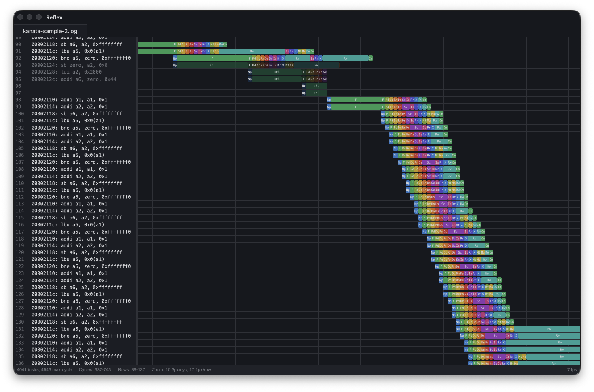

<p align="center">
  
</p>

<h1 align="center">Reflex</h1>

<p align="center">A fast, GPU-accelerated CPU pipeline trace visualizer.<br>Built with <a href="https://gpui.rs">GPUI</a> (Zed's rendering framework).</p>



## Features

- **Konata & µScope formats** — Native support for both [Konata](https://github.com/shioyadan/Konata) text traces and [µScope](https://github.com/zarubaf/uscope) binary traces
- **GPU-rendered pipeline view** — Smooth panning, zooming, and scrolling at 60fps for traces with thousands of instructions
- **Tabbed interface** — Open multiple traces side-by-side, each with independent viewport state
- **Multicursor** — Place multiple cursors to measure cycle deltas between pipeline events
- **Stage annotations** — Hover over instructions to see annotations as tooltips
- **macOS native** — `.app` bundle with dock icon drop support, signed and notarized

## Getting Started

```
cargo run                           # Start with empty window
cargo run -- path/to/trace.log      # Open a trace file directly
```

Or drag and drop trace files onto the window.

## Keyboard Shortcuts

| Key               | Action                             |
| ----------------- | ---------------------------------- |
| Scroll / Trackpad | Pan                                |
| Ctrl + Scroll     | Zoom in / out                      |
| Cmd + = / Cmd + - | Zoom in / out                      |
| Cmd + 0           | Zoom to fit                        |
| j / k             | Select next / previous instruction |
| Cmd + F           | Search instructions                |
| Cmd + L           | Go to cycle                        |
| Cmd + O           | Open trace file                    |
| Cmd + R           | Reload current trace               |
| Cmd + G           | Generate random trace              |
| Cmd + W           | Close tab                          |
| Cmd + M           | Add cursor                         |
| Ctrl + Tab        | Next tab                           |
| ?                 | Toggle help overlay                |

## Trace Formats

- **Konata/Kanata** (`.log`, `.konata`, `.kanata`) — The [Kanata log format](https://github.com/shioyadan/Konata/blob/master/docs/kanata-log-format.md) used by CPU simulators. Compatible with [Konata](https://github.com/shioyadan/Konata).
- **µScope** (`.uscope`) — Binary format from [µScope](https://github.com/zarubaf/uscope) with CPU protocol semantics, checkpointed random access, and LZ4 compression.

## Building

Requires Rust and macOS (GPUI currently targets macOS).

```
cargo build --release
```
